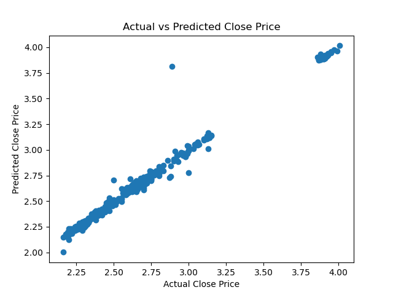
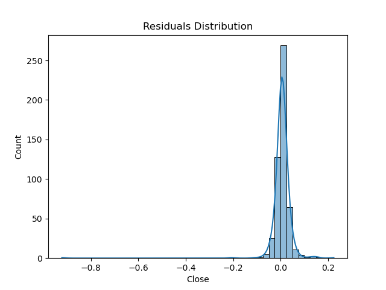

# 📈 ADNOC Stock Close Price Prediction (Linear Regression)
### Previous-Day Features • Time-Based Split • Residual Diagnostics

A simple and explainable ML project that predicts **ADNOC's Close Price** using **previous-day market data** and evaluates performance with **RMSE**, **R²**, and residual analysis.

---

## ✨ What this model does
This model predicts the **Close price** for a trading day using the **previous day's**:
- Open
- High
- Low
- Volume
- Close

Instead of using same-day values (which can cause leakage), we shift the features by 1 day:

- `Prev_Open = Open.shift(1)`
- `Prev_High = High.shift(1)`
- `Prev_Low = Low.shift(1)`
- `Prev_Volume = Volume.shift(1)`
- `Prev_Close = Close.shift(1)`

✅ This makes the task more realistic: the model uses **past information** to predict the **future**.

---

## 🧠 Model
- **Algorithm:** Linear Regression
- **Task:** Regression (predict a continuous value: Close price)
- **Key Idea:** Use lagged (previous-day) features

---

## ⏱️ Train/Test Split (Time-Based)
For stock data, random splitting is not ideal because it can mix past & future data.

So we use a time-based split:
- **First 60%** of rows → training
- **Last 40%** of rows → testing

This better simulates real forecasting:
> Train on earlier time → test on later time.

---

## 📊 Evaluation
### Metrics
- **RMSE** (Root Mean Squared Error): average prediction error magnitude
- **R² Score**: how well the model explains the variance in Close price

### Visual Diagnostics
1) **Actual vs Predicted Scatter Plot**  
If points follow a diagonal trend → predictions are strong.

2) **Residuals Distribution**  
A bell-shaped curve around 0 → errors are balanced (no strong bias).

### Visual Diagnostics

  
  

- **Actual vs Predicted:** Points forming a diagonal pattern indicate strong predictions.
- **Residuals Distribution:** A bell-shaped curve centered near zero indicates balanced errors with no major bias.
